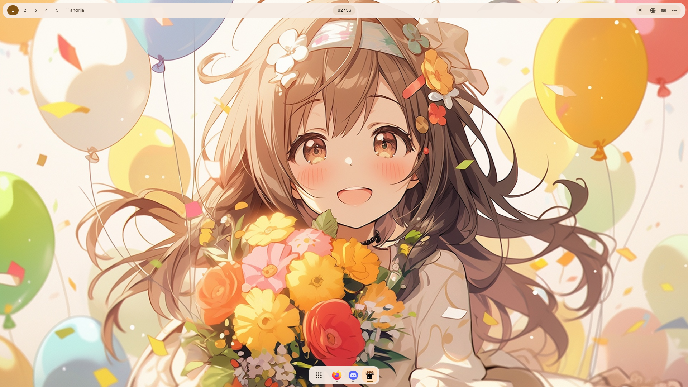
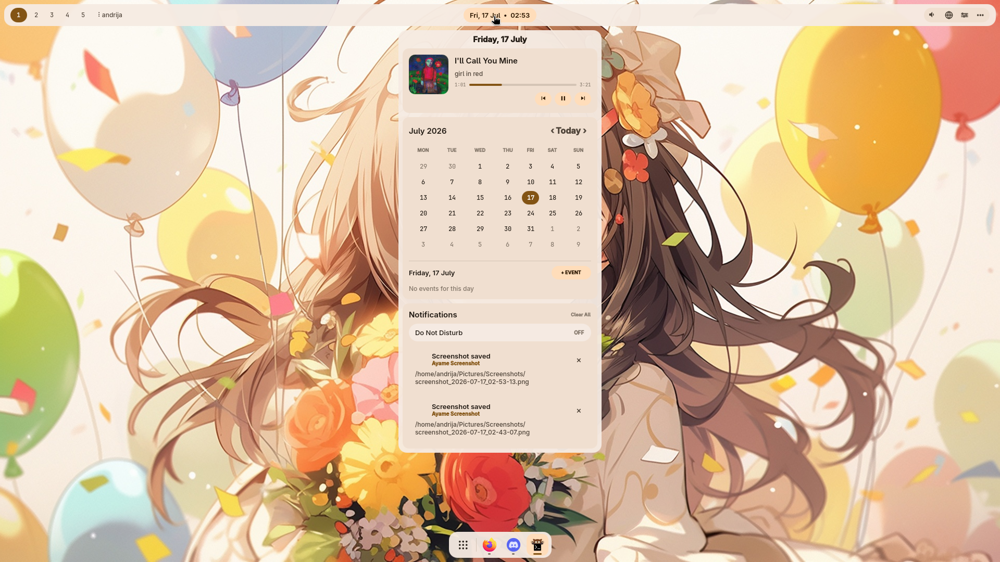
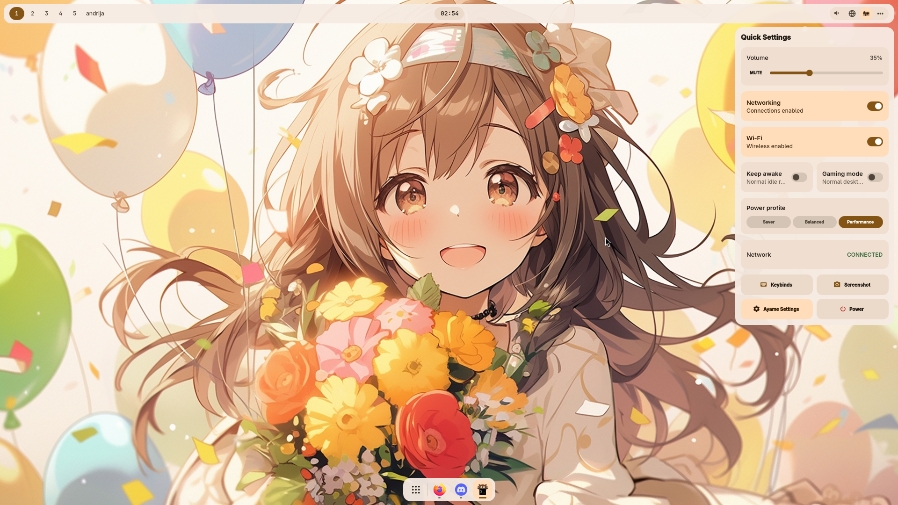
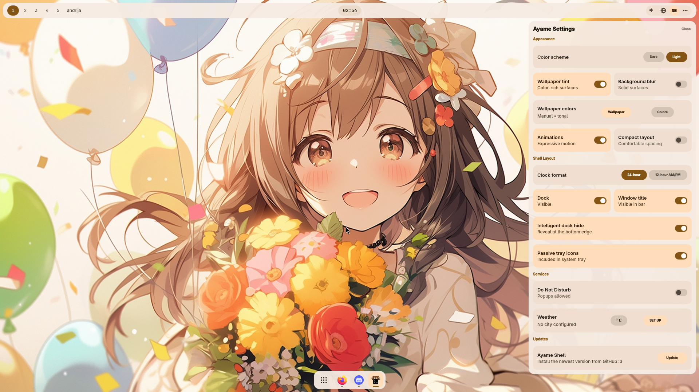
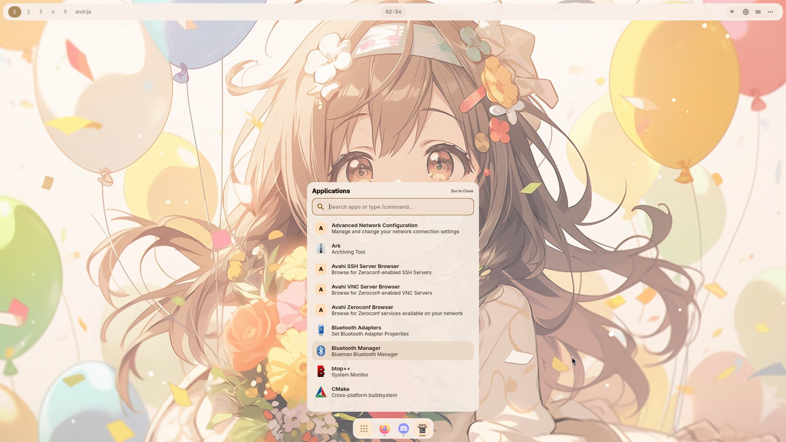
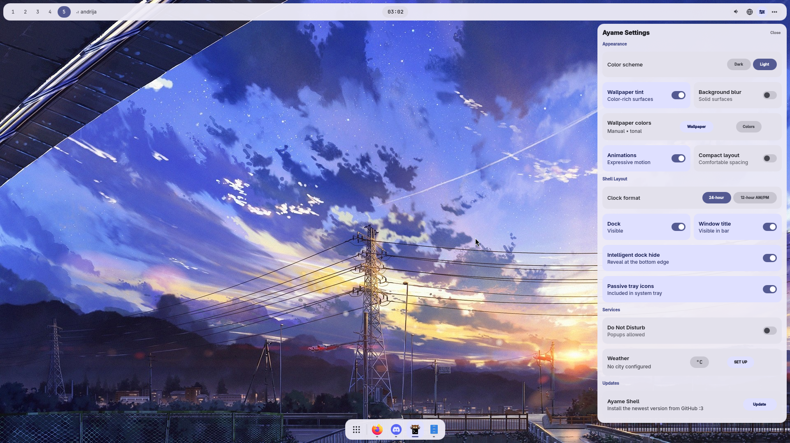
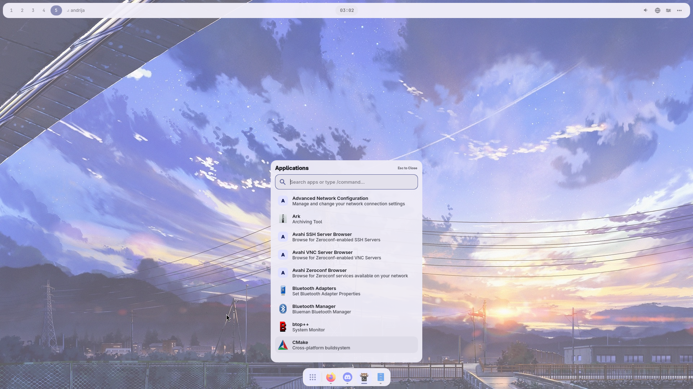
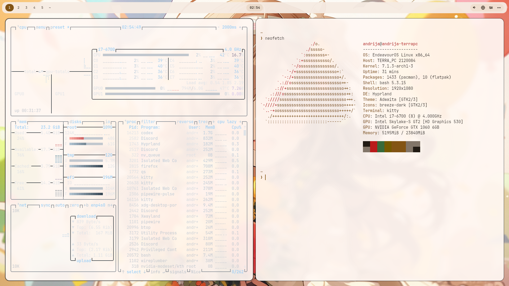

# Ayame Shell

An original, modular Hyprland and Quickshell desktop shell for Endeavour OS/Arch based systems.

Please keep in mind that this is in beta, changes will occur in future releases.

The project is developed and tested outside `~/.config`. Nothing in this
repository is installed automatically.

## Showcase



<table>
  <tr>
    <td width="50%">
      
      <br><sub><b>Dashboard</b> — media, calendar, events, and notifications</sub>
    </td>
    <td width="50%">
      
      <br><sub><b>Quick Settings</b> — connectivity, power profiles, and session controls</sub>
    </td>
  </tr>
  <tr>
    <td width="50%">
      
      <br><sub><b>Ayame Settings</b> — appearance, layout, services, and updates</sub>
    </td>
    <td width="50%">
      
      <br><sub><b>Application launcher</b> — searchable apps and terminal commands</sub>
    </td>
  </tr>
</table>

### Wallpaper-adaptive colors

Ayame can generate a new shell and terminal palette from the active wallpaper,
while retaining the same visual language across every surface.

<table>
  <tr>
    <td width="50%">
      
      <br><sub><b>Settings</b> with a cool blue wallpaper palette</sub>
    </td>
    <td width="50%">
      
      <br><sub><b>Application launcher</b> following the same generated colors</sub>
    </td>
  </tr>
</table>



<p align="center"><sub><b>Kitty</b> — wallpaper-matched colors, transparency, and comfortable spacing</sub></p>

## Current shell

Ayame currently includes a monitor-aware top bar and running-app dock, animated
dashboard with media, weather, calendar and local events, capability-driven
Quick Settings, persistent layout and reduced-motion preferences, and optional
wallpaper-following palettes generated locally by Matugen, with a manual image
override and the original Ayame Violet fallback. A dedicated Settings surface
owns persistent light/dark appearance, tint, blur, motion, density, and layout,
while Quick Settings focuses on live device and session controls.
An opt-in notification server provides queued popups, native actions, dashboard
history, dismiss/clear controls, and Do Not Disturb without taking ownership from
the user's current notification daemon during previews.
The Utilities surface documents recovery-friendly window keybinds and captures
the desktop, active monitor, or selected area instantly or after a countdown.
The searchable application launcher can be opened from the dock and exposes a
compositor-safe IPC toggle for an optional keyboard binding.
Fresh installations start with Ayame's bundled CC0 anime wallpaper; existing
wallpaper choices are preserved. Press `Super + .` to open the emoji picker,
then paste the copied emoji normally.

The Screenshot action in Quick Settings opens a movable capture pill that
slides in from the left. It supports desktop, monitor, and area screenshots;
instant, three-second, and five-second countdowns; and screen recording with
silent, system-audio, or microphone modes. Drag it freely or near an edge to
snap it left or right. While recording, the pill shows elapsed time and remains
available as the stop control. Recordings are saved under `Videos/Recordings`.
`Super + Shift + R` is an emergency desktop record/stop toggle.
Prefix launcher input with `/` to run a shell command; the prefix is a launcher
cue and is not passed to the command. Desktop-entry metadata keeps graphical apps
such as Firefox direct, while terminal programs such as `btop` open in Kitty.
Quick Settings also opens a full-screen power surface with safe Lock, Log Out,
Restart, and Shut Down actions. The repository includes an Ayame Hyprlock design,
but does not replace the user's live lock configuration during development.
Log Out detects the active display-manager capabilities at runtime. Plasma Login
Manager, SDDM, GDM, and LightDM receive an explicit greeter handoff; greetd,
tuigreet, Ly, and other logind-managed sessions use the universal session-exit
fallback. Ayame does not install, replace, or enable a display manager.

## Test without installing

From a terminal inside the running Hyprland session:

```bash
qs --path "$HOME/Projects/ayame-shell/config/quickshell"
```

Stop it with `Ctrl+C` in the same terminal. This command does not modify the
live Hyprland or Quickshell configuration.

Installed sessions launch Ayame through `ayame-shell.service`. If Quickshell
crashes unexpectedly, systemd starts it again after two seconds. A deliberate
clean exit remains stopped until the next login or manual service start.

## Install

### Quick install

Install the latest public version directly from GitHub:

```bash
curl -fsSL https://raw.githubusercontent.com/andrija677/ayame-shell/main/bootstrap.sh | bash
```

NOTE:Arch based distros only,Endeavour OS recommended

If you choose desktop replacement, Ayame backs up existing Hyprland and
Quickshell dotfiles before installing its standalone configuration. Conflicting
notification services are recoverably masked so they cannot race Ayame for the
notification D-Bus name, and uninstall or migration rollback restores their
previous enabled/running state.

Future updates will allow support for more distros. (hopefully)

The bootstrap downloads the complete repository into a temporary directory and
runs the same interactive installer described below. Review
[`bootstrap.sh`](bootstrap.sh) and [`install.sh`](install.sh) before piping them
to a shell if you prefer to inspect remote scripts first.

### Install from a clone

From the cloned repository, run:

```bash
./install.sh
```

The installer checks dependencies, previews its destination, backs up an existing
Ayame installation, installs under `~/.local/share/ayame-shell`, creates the
`~/.local/bin/ayame-shell` launcher, and optionally adds one backed-up Hyprland
source line. Ordinary installation never replaces existing Quickshell, Hyprlock,
or Hypridle files. Ayame launches its own installed Hyprlock configuration
explicitly, so a user's global lock configuration remains untouched.
On EndeavourOS and Arch Linux it offers to install missing core packages with
`pacman`, including Hyprland, Quickshell, Hyprlock, the screenshot tools, and
Kitty. Pass `--no-install-deps` to require a pre-provisioned system instead.
When Hyprland has no user configuration yet, the installer can create a minimal
Hyprland 0.55 Lua profile that loads Ayame and starts it only for Hyprland logins. It does not
autostart Ayame in KDE Plasma or other desktop sessions.
Autostart waits briefly for the graphical session and records diagnostics under
`~/.local/state/ayame-shell/startup.log`. Super+Enter opens Kitty, with
Ctrl+Alt+T available as a VM-friendly fallback. Super+L opens Ayame's lock screen
using the current Ayame wallpaper.
A separately included Kitty fragment provides the Ayame Violet
terminal palette, spacing, transparency, and Ctrl+V clipboard paste without
replacing an existing Kitty configuration.
Kitty integration is enabled by default and follows Ayame's Matugen wallpaper
palette; pass `--no-kitty` to leave Kitty completely untouched.
Run the installed `uninstall.sh` to remove only Ayame-owned files and its generated
source line; pre-install backups are retained.

To deliberately replace an existing Hyprland and Quickshell desktop, use:

```bash
./install.sh --replace-desktop
```

Or perform the same replacement through the GitHub bootstrap:

```bash
curl -fsSL https://raw.githubusercontent.com/andrija677/ayame-shell/main/bootstrap.sh | bash -s -- --replace-desktop
```

This previews detected configs, moves the active `hypr` and `quickshell` roots
(including symlinks) into one timestamped state backup, installs a standalone
Ayame profile, and prints the path to a generated rollback script. Supporting
ML4W, Waybar, Hyprlock, and UWSM data is detected but left untouched. Known
standalone notification daemons are stopped and user-masked with their previous
state recorded for uninstall or rollback.
The running session is never terminated by the installer; switch after logout.

See [docs/TESTING.md](docs/TESTING.md) for troubleshooting and rollback steps.
