<h1 align="center">Ayame Shell</h1>

<p align="center">
  A warm, wallpaper-adaptive Hyprland desktop built with Quickshell.
</p>

<p align="center">
  
  
  
  
</p>

<p align="center">
  <a href="#showcase">Showcase</a> ·
  <a href="#highlights">Highlights</a> ·
  <a href="#ayame-ai">Ayame AI</a> ·
  <a href="#install">Install</a> ·
  <a href="docs/TESTING.md">Testing & rollback</a>
</p>

Ayame is an original, modular shell with a top bar, intelligent dock,
application launcher, dashboard, notifications, Quick Settings, capture tools,
wallpaper-generated colors, and an optional AI companion. Hardware-dependent
controls appear only when the system supports them.

> [!IMPORTANT]
> Ayame is beta software. EndeavourOS and Arch Linux are the supported
> installation targets. Debian-family detection and dependency auditing are
> available for testing, but many stable releases do not provide a sufficiently
> recent Hyprland and Quickshell stack.

The repository is developed outside `~/.config`, and cloning it changes
nothing on the system. Installation occurs only after running the installer.

```bash
curl -fsSL https://raw.githubusercontent.com/andrija677/ayame-shell/main/bootstrap.sh | bash
```

Read [Install](#install) before using desktop replacement or testing a
Debian-family system.

## Showcase

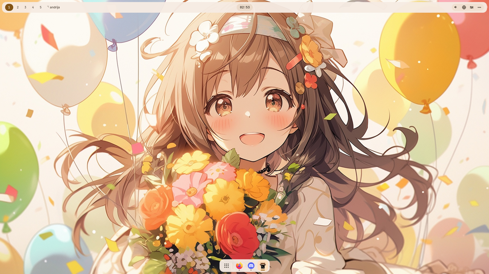

<table>
  <tr>
    <td width="50%">
      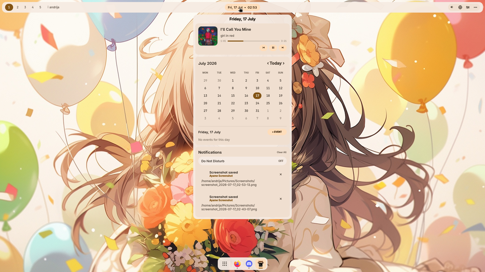
      <br><sub><b>Dashboard</b> — media, calendar, events, and notifications</sub>
    </td>
    <td width="50%">
      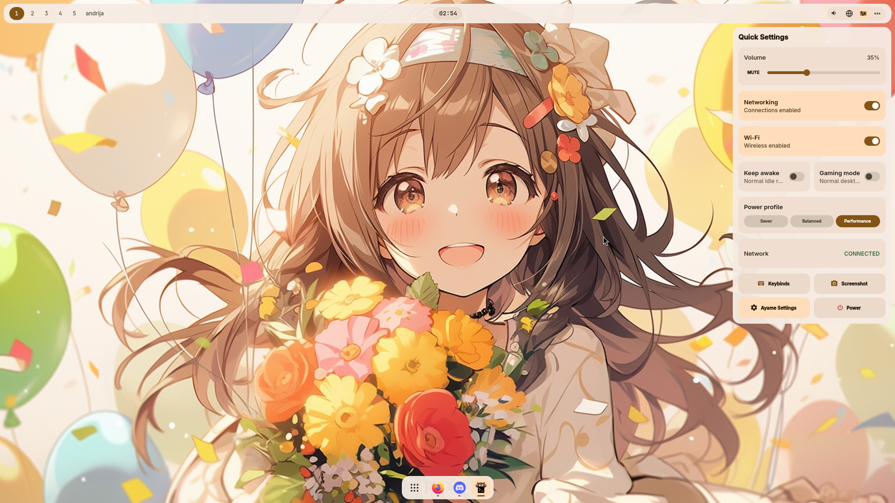
      <br><sub><b>Quick Settings</b> — connectivity, power profiles, and session controls</sub>
    </td>
  </tr>
  <tr>
    <td width="50%">
      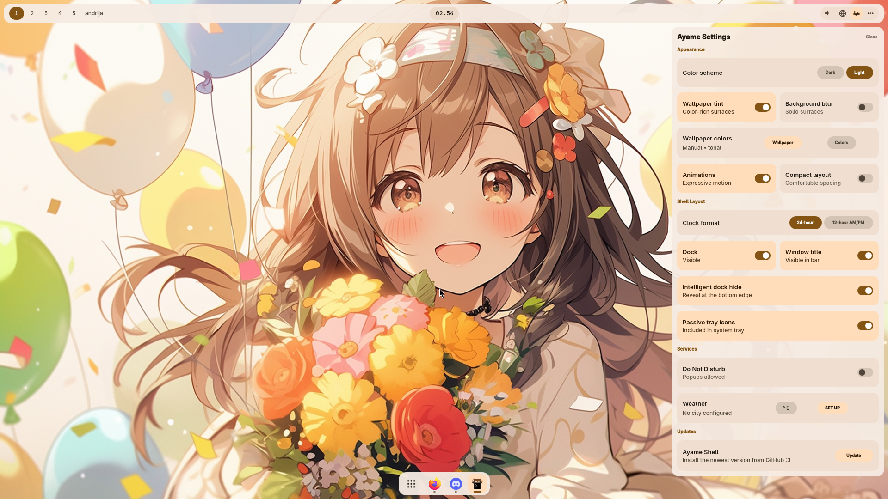
      <br><sub><b>Ayame Settings</b> — appearance, layout, services, and updates</sub>
    </td>
    <td width="50%">
      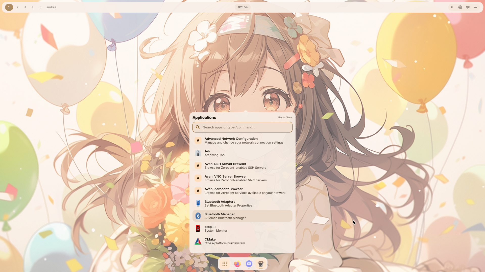
      <br><sub><b>Application launcher</b> — searchable apps and terminal commands</sub>
    </td>
  </tr>
</table>

## Highlights

| Desktop | Devices and workflow | Personalization |
|---|---|---|
| Monitor-aware top bar and animated dock | Wi-Fi, Bluetooth, audio-output and power controls | Automatic wallpaper and terminal palettes |
| Searchable app and command launcher | Screenshot, recording and area-capture pill | Light/dark, tint, blur, density and motion |
| Dashboard, media, calendar and weather | Brightness, Night Light, idle locking and displays | Responsive panels for small or scaled screens |
| Notification history, actions and DND | Privacy indicators for microphone and camera | First-run guidance and built-in diagnostics |

Unsupported device controls disappear instead of becoming dead buttons.
Display mode changes are staged for the next login to avoid destabilizing the
running compositor.

### Wallpaper-adaptive colors

Ayame can generate a new shell and terminal palette from the active wallpaper,
while retaining the same visual language across every surface.

<table>
  <tr>
    <td width="50%">
      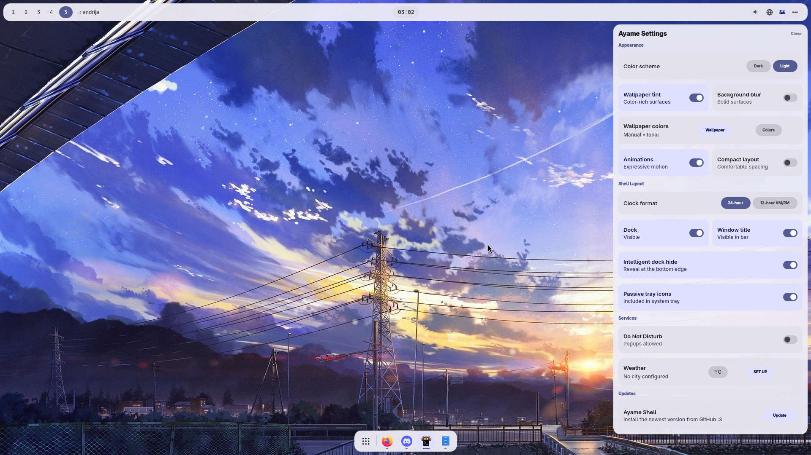
      <br><sub><b>Settings</b> with a cool blue wallpaper palette</sub>
    </td>
    <td width="50%">
      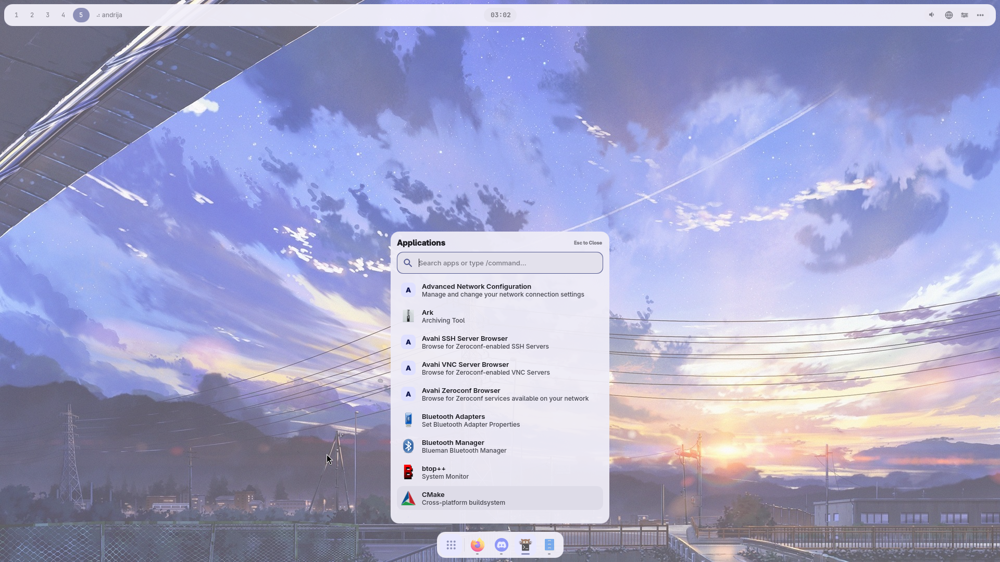
      <br><sub><b>Application launcher</b> following the same generated colors</sub>
    </td>
  </tr>
</table>

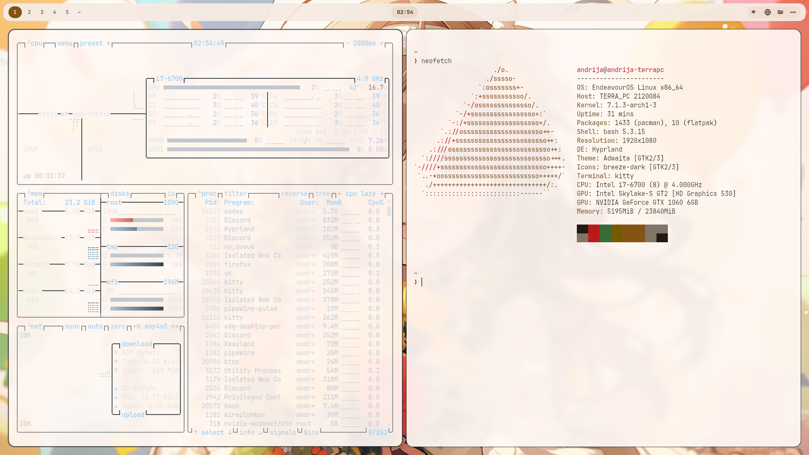

<p align="center"><sub><b>Kitty</b> — wallpaper-matched colors, transparency, and comfortable spacing</sub></p>

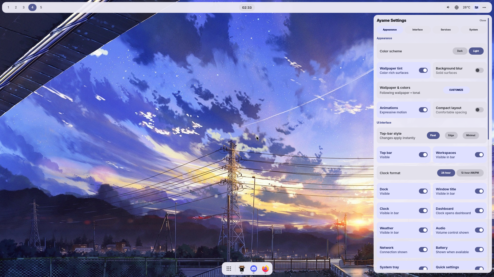

<p align="center"><sub><b>One wallpaper, one visual language</b> — the shell, controls, and highlights move together</sub></p>

## Ayame AI

Ayame includes an optional shell companion with Gemini, OpenAI-compatible, and
local Ollama providers. It is **disabled by default**: no button, process,
API key, or network request is present until the user enables it in
**Ayame Settings → Services → Ayame AI**.

Move the pointer into the bottom-left corner to reveal its bubble. The bubble
expands into a compact chat panel with streaming responses and an original
palette-colored thinking animation. Available personalities include Assistant,
Cat-girl, Fox-girl, and a completely editable custom system prompt.

API keys are stored through the desktop's Secret Service implementation—not in
Ayame settings. KWallet, GNOME Keyring, KeePassXC Secret Service, and compatible
providers are supported. Ayame can start an installed KWallet or GNOME backend
when a minimal Hyprland session has not already done so.

> [!NOTE]
> A ChatGPT subscription does not include OpenAI API usage. Cloud-provider
> messages are subject to that provider's terms, quota, and billing. Ollama
> remains local and requires no API key.

The companion has no automatic access to commands, files, clipboard history,
screenshots, microphone, camera, or shell state. It cannot execute commands.

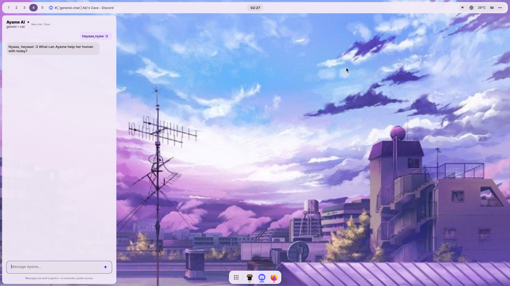

<p align="center"><sub><b>Cat-girl mode confirmed operational</b> — serious Linux assistance may contain trace amounts of <code>:3</code></sub></p>

## Aesthetic checks

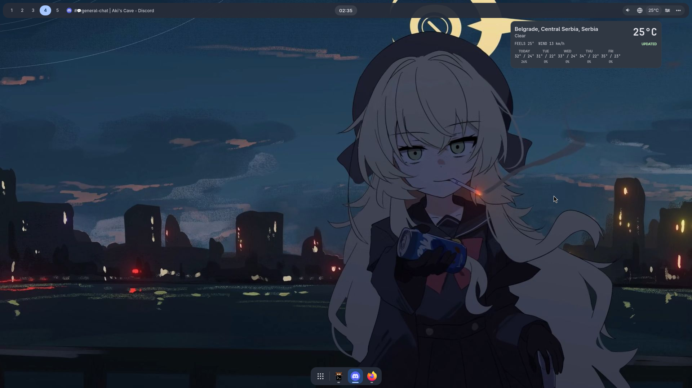

<p align="center"><sub><b>Professor Niyaniya</b>, a.k.a. the Smiling Professor / Professor Smug — palette matching still passed with honors</sub></p>

## Privacy and local data

| Feature | Default | Data handling |
|---|---:|---|
| AI companion | Off | Messages go only to the configured provider; Ollama is local |
| Clipboard history | Off | Text and image previews stay local; password-manager payloads are excluded |
| Notifications | Safe preview | Ayame does not take the notification D-Bus name while another daemon owns it |
| Wallpaper colors | Optional | Matugen processes the selected image locally |
| Weather | Off | Enabled only after a location is configured |

## Everyday controls

- Open the launcher from the dock; prefix text with `/` to run a command.
- Use **Add AppImage** in the launcher to register standalone AppImages that do
  not provide an application-menu entry of their own.
- Press `Super + .` for the emoji picker.
- Open Screenshot from Quick Settings for desktop, monitor, or area capture,
  countdowns, and silent/system-audio/microphone recording.
- Use `Super + Shift + R` as the emergency desktop record/stop toggle.
- Open Power for Lock, Log Out, Restart, and Shut Down.
- Run `ayame-shell doctor` for service and hardware diagnostics.

Recordings are saved under `~/Videos/Recordings`. Installed sessions run through
`ayame-shell.service`; unexpected Quickshell crashes recover automatically after
two seconds.

## Test without installing

From a terminal inside the running Hyprland session:

```bash
qs --path "$HOME/Projects/ayame-shell/config/quickshell"
```

Stop it with `Ctrl+C` in the same terminal. This command does not modify the
live Hyprland or Quickshell configuration.

Installed sessions launch Ayame through `ayame-shell.service`. If Quickshell
crashes unexpectedly, systemd starts it again after two seconds. A deliberate
clean exit remains stopped until the next login or manual service start.

## Install

### Quick install

Install the latest public version directly from GitHub:

```bash
curl -fsSL https://raw.githubusercontent.com/andrija677/ayame-shell/main/bootstrap.sh | bash
```

**EndeavourOS and Arch Linux are currently the supported installation
platforms.** Debian-family installation is not generally supported yet; its
automatic detection and dependency audit are available for beta testing. The
same installer recognizes Debian, Ubuntu, Linux Mint, Zorin OS, and related
distributions through `/etc/os-release`, then checks the appropriate `apt`
package mappings without assuming they exist.

Ubuntu-derived point releases may not provide a sufficiently recent Hyprland,
Quickshell, Hyprlock, Hyprpaper, Matugen, or Rofimoji. Ayame checks repository
availability and stops safely when the compatible core stack cannot be obtained;
it never adds an untrusted PPA or mixes packages from another distribution
release.

**Linux Mint 22.x is currently unsupported for a full Ayame installation.** A
real Linux Mint 22.3/Noble test confirmed that its official repositories do not
provide Ayame's required Quickshell, Hyprland 0.55+, Hyprlock, Hyprpaper,
Matugen, or Rofimoji packages. The compatibility checker works there, but the
installer will stop rather than add a third-party PPA or mix Ubuntu releases.

Run a read-only compatibility report before installing:

```bash
curl -fsSL https://raw.githubusercontent.com/andrija677/ayame-shell/main/bootstrap.sh | bash -s -- --check
```

This downloads Ayame into a temporary directory and reports OS detection,
missing commands, mapped package names, and APT availability without installing
packages or changing desktop configuration.

If you choose desktop replacement, Ayame backs up existing Hyprland and
Quickshell dotfiles before installing its standalone configuration. Conflicting
notification services are recoverably masked so they cannot race Ayame for the
notification D-Bus name, and uninstall or migration rollback restores their
previous enabled/running state.

The bootstrap downloads the complete repository into a temporary directory and
runs the same interactive installer described below. Review
[`bootstrap.sh`](bootstrap.sh) and [`install.sh`](install.sh) before piping them
to a shell if you prefer to inspect remote scripts first.

### Install from a clone

From the cloned repository, run:

```bash
./install.sh
```

The installer checks dependencies, previews its destination, backs up an existing
Ayame installation, installs under `~/.local/share/ayame-shell`, creates the
`~/.local/bin/ayame-shell` launcher, and optionally adds one backed-up Hyprland
source line. Ordinary installation never replaces existing Quickshell, Hyprlock,
or Hypridle files. Ayame launches its own installed Hyprlock configuration
explicitly, so a user's global lock configuration remains untouched.
On EndeavourOS and Arch Linux it offers to install missing packages with
`pacman`. On detected Debian-family systems it verifies candidate package names
with APT before asking to install them. This includes the newer Ayame runtime
requirements for NetworkManager, PipeWire inspection, desktop notifications,
and Python. Pass `--no-install-deps` to require a pre-provisioned system instead.
When Hyprland has no user configuration yet, the installer can create a minimal
Hyprland 0.55 Lua profile that loads Ayame and starts it only for Hyprland logins. It does not
autostart Ayame in KDE Plasma or other desktop sessions.
Autostart waits briefly for the graphical session and records diagnostics under
`~/.local/state/ayame-shell/startup.log`. Super+Enter opens Kitty, with
Ctrl+Alt+T available as a VM-friendly fallback. Super+L opens Ayame's lock screen
using the current Ayame wallpaper.
A separately included Kitty fragment provides the Ayame Violet
terminal palette, spacing, transparency, and Ctrl+V clipboard paste without
replacing an existing Kitty configuration.
Kitty integration is enabled by default and follows Ayame's Matugen wallpaper
palette; pass `--no-kitty` to leave Kitty completely untouched.
Run the installed `uninstall.sh` to remove only Ayame-owned files and its generated
source line; pre-install backups are retained.

To deliberately replace an existing Hyprland and Quickshell desktop, use:

```bash
./install.sh --replace-desktop
```

Or perform the same replacement through the GitHub bootstrap:

```bash
curl -fsSL https://raw.githubusercontent.com/andrija677/ayame-shell/main/bootstrap.sh | bash -s -- --replace-desktop
```

This previews detected configs, moves the active `hypr` and `quickshell` roots
(including symlinks) into one timestamped state backup, installs a standalone
Ayame profile, and prints the path to a generated rollback script. Supporting
ML4W, Waybar, Hyprlock, and UWSM data is detected but left untouched. Known
standalone notification daemons are stopped and user-masked with their previous
state recorded for uninstall or rollback.
The running session is never terminated by the installer; switch after logout.

See [docs/TESTING.md](docs/TESTING.md) for troubleshooting and rollback steps.
